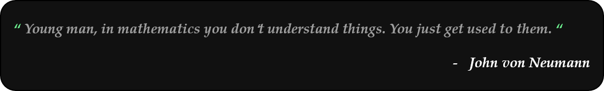

[放星星的博客](https://flyastar.top/) 博主是个水货，欢迎来我的网站看看，不过目前尚不完善

<!-- 打招呼 访问次数 社交媒体账号 -->
### Hi there 👋  I'm 放星星  &emsp;&emsp;

<!--  数学你不是理解了它，只是习惯了它-->

 <!-- 友好的展开 -->

<em><b>I love connecting with different people</b> so if you want to say <b>hi, I'll be happy to meet you more!</b> : )</em>

• 本有机会去开飞机✈️，maybe差10多分，本科一般，但相比发挥失常/复读等等还是幸运的
 • 不惜喧闹，不擅长罢
  • 对CS感兴趣，但是自制力不行

  

 <!-- 个人介绍 -->

<h2>GitHub profile：</h2>

- 🌱 学习ing：CTF的WEB方向和渗透(市场需求大)；数据结构、计组备考中，南京大学2023操作系统&&CSAPP学习中
- 👯 希望合作：求师傅带，偏向：[如何找到一个做信息安全的师父?](https://www.zhihu.com/question/473311505/answer/2010587795)；)交朋友拓宽圈子😀
- 😄 代号: 放星星；fangxingxing；flyAstar✨[Halo]
- ⚡ 爱好：跑步🏃,电影📺,看书📖
- 🔭 长期：想考研，(新)一线城市211打底 | Dream: BIT

 <!-- 技术栈 -->
## 技术栈(没啥技术栈:cry:)：[个人技术栈总结](https://flyastar.top/2023/05/14/%E4%B8%AA%E4%BA%BA%E6%8A%80%E6%9C%AF%E6%A0%88%E6%80%BB%E7%BB%93/)
靠北，菜就多练，多和别人交流比较，才能知道自己到底几斤几两，而不是活在自己的幻想中|独学而无友，则孤陋而寡闻

 <!-- Github等级||语言占比 -->

 

<!--
Overview参考，放在下面注释里了：
https://github.com/sun0225SUN （花哨，介绍，GitHub展板）
https://github.com/Charmve （展开栏）
https://github.com/scotch-io/All-Github-Emoji-Icons （icon）
-->
